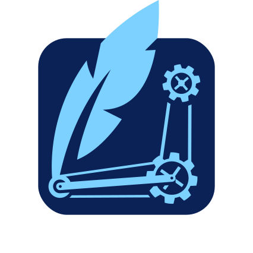

  

<h1 align="center">
  CG/SQL
</h1>

CG/SQL is a code generation system for the popular SQLite library that allows developers to write stored procedures in a variant of Transact-SQL (T-SQL) and compile them into C code that uses SQLite’s C API to do the coded operations. CG/SQL enables engineers to create highly complex stored procedures with very large queries, without the manual code checking that existing methods require.

The full system also includes features for managing and upgrading schema, creating test code for stored procedures, getting query plans for procedures, as well as interfacing with stored procedures from other languages, such as Java and Objective-C. The JSON output allows for the creation of even more analysis or interfacing code. The package includes extensive documentation on the language and system.

Find out more at our [website](https://cgsql.dev/).

## Getting Started

Please refer to our documentation to start using CG/SQL:
- [CG/SQL Language Summary](https://cgsql.dev/docs/introduction)
- [Getting Started with CG/SQL](https://cgsql.dev/docs/getting-started)
- [Writing a Hello World Program](https://cgsql.dev/cql-guide/ch01#getting-started)
- [Playground](https://cgsql.dev/docs/playground)

For Contributors:
- [Typical Dev Cycle](https://cgsql.dev/docs/dev-notes)
- [Testing CG/SQL](https://cgsql.dev/docs/testing)
- [Code Coverage](https://cgsql.dev/docs/code-coverage)

## Licensing

CG/SQL is [MIT-licensed](./LICENSE).
